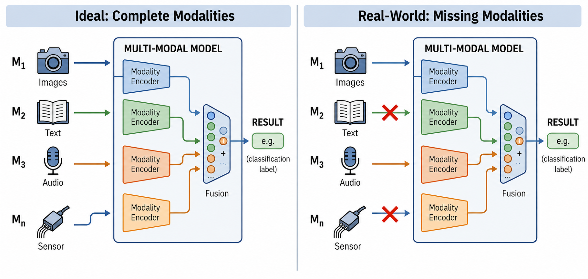

# Awesome Modality Missing Learning 

A collection of research studies centered on ***Modality Missing Learning (MML)*** (also referred to as Incomplete Multimodal Learning).

# 🆕 Latest Accepted Conference Papers

- **[CP-IMoE: Collaborative Prompt-Guided Interactive Mixture-of-Experts for Incomplete Multimodal Learning](https://openaccess.thecvf.com/content/CVPR2026F/papers/Li_CP-IMoE_Collaborative_Prompt-Guided_Interactive_Mixture-of-Experts_for_Incomplete_Multimodal_Learning_CVPRF_2026_paper.pdf)**  

  `CVPR Finding 2026` · [Code](https://github.com/lijing-coder/CP-IMoE) · [Mixture-of-Experts](#mixture-of-experts-methods)

- **[Uni-Encoder Meets Multi-Encoders: Representation Before Fusion for Brain Tumor Segmentation with Missing Modalities](https://openaccess.thecvf.com/content/CVPR2026/papers/Song_Uni-Encoder_Meets_Multi-Encoders_Representation_Before_Fusion_for_Brain_Tumor_Segmentation_CVPR_2026_paper.pdf)**  

  `CVPR 2026` · [Code](https://github.com/Hooorace-S/UniME) · [Shared Representation](#multimodal-shared-representation-learning-methods)

- **[DPL: Decoupled Prototype Learning for Enhancing Robustness of Vision-Language Transformers to Missing Modalities](https://openaccess.thecvf.com/content/CVPR2026/papers/Lu_DPL_Decoupled_Prototype_Learning_for_Enhancing_Robustness_of_Vision-Language_Transformers_CVPR_2026_paper.pdf)**  

  `CVPR 2026` · Code: N/A · [Transformer-oriented](#multimodal-transformer-oriented-methods)

- **[Anchor-Guided Gradient Alignment for Incomplete Multimodal Learning](https://openaccess.thecvf.com/content/CVPR2026/papers/Guan_Anchor-Guided_Gradient_Alignment_for_Incomplete_Multimodal_Learning_CVPR_2026_paper.pdf)**  

  `CVPR 2026` · Code: N/A · [Modality Enhancement](#modality-enhancement-learning-methods)

- **[Beyond Missing Modalities: Hypergraph Conditioned Diffusion for Uncertainty-Aware Multimodal Emotion Recognition](https://openaccess.thecvf.com/content/CVPR2026/papers/Qiu_Beyond_Missing_Modalities_Hypergraph_Conditioned_Diffusion_for_Uncertainty-Aware_Multimodal_Emotion_CVPR_2026_paper.pdf)**  

  `CVPR 2026` · Code: N/A · [Reconstruction-based](#reconstruction-based-methods)

- **[AOEPT: Breaking the Implicit Modality-Reduction Bottleneck in Modality Missing Prompt Tuning](https://arxiv.org/abs/2605.24816)**  

  `ICML 2026` · [Code](https://github.com/Jian-Lang/AOEPT) · [Transformer-oriented](#multimodal-transformer-oriented-methods)

- **[LIMSSR: LLM-Driven Sequence-to-Score Reasoning under Training-Time Incomplete Multimodal Observations](https://icml.cc/virtual/2026/poster/66773)**  

  `ICML 2026` · Code: N/A · [Reconstruction-based](#reconstruction-based-methods)

- **[Calibrated Multimodal Representation Learning with Missing Modalities](https://icml.cc/virtual/2026/poster/66039)**  

  `ICML 2026` · Code: N/A · [Reconstruction-based](#reconstruction-based-methods)

- **[API: Adaptive Prototype Imputation for Incomplete Multimodal Sentiment Analysis](https://icml.cc/virtual/2026/poster/64448)**  

  `ICML 2026` · Code: N/A · [Reconstruction-based](#reconstruction-based-methods)

- **[Characterizing the Predictive Impact of Modalities with Supervised Latent-Variable Modeling](https://arxiv.org/pdf/2602.16979)**  

  `ICML 2026` · Code: N/A · [Reconstruction-based](#reconstruction-based-methods)

# 📢 News

+ 2026.05.26 🔥 We add the newly accepted methods in **ICML 2026** (e.g., [AOEPT](https://arxiv.org/abs/2605.24816)). We also add a module to showcase the **Latest Accepted Conference Paper for MML**.
+ 2026.04.14 🔨 We release the awesome-modality-missing-learning, which collects the methods mainly published in conferences for Modality Missing Learning (MML).

# 📖 Contents
- [📃 Paper List](#📃-paper-list)
  - [📚 Survey](#survey)
  - [🧩 Reconstruction-based Methods](#reconstruction-based-methods)
  - [🔗 Multimodal Shared Representation Learning Methods](#multimodal-shared-representation-learning-methods)
  - [🎓 Teacher-Student Distillation and Alignment Methods](#teacher-student-distillation-and-alignment-methods)
  - [🔎 Retrieval-Augmented Methods](#retrieval-augmented-methods)
  - [📊 Mixture-of-Experts Methods](#mixture-of-experts-methods)
  - [⚖️ Modality Enhancement Learning Methods](#modality-enhancement-learning-methods)
  - [🔄 Continual Missing Modality Learning Methods](#continual-missing-modality-learning-methods)
  - [⚙️ Multimodal Transformer-oriented Methods](#multimodal-transformer-oriented-methods)
  - [🤖 Large Multimodal Model-oriented Methods](#large-multimodal-model-oriented-methods)
  - [🎯 Downstream Applications](#downstream-applications)
    - [🏥 Medical Applications](#medical-applications)
    - [😊 Multimodal Sentiment Analysis](#multimodal-sentiment-analysis)
    - [🧪 Other Applications](#other-applications)
  - [📦 Others](#others)
- [🏆 Benchmarks](#benchmarks)
  - [🏥 Medical](#benchmarks-medical)
  - [😊 Sentiment Analysis](#benchmarks-sentiment-analysis)
  - [📦 Others](#benchmarks-others)
- [📮 Contact Us](#📮-contact-us)

# 📃 Paper List

## 📚 Survey

| Title | Venue | Year | Code |
|-------|-------|------|------|
| [Deep Multimodal Learning with Missing Modality: A Survey](https://openreview.net/pdf?id=tc7RFcx4hT) | TMLR | 2026 | N/A |
| [Multimodal Learning Under Imperfect Data Conditions: A Survey](https://www.techrxiv.org/doi/full/10.36227/techrxiv.176410566.65375877) | arxiv | 2026 | N/A |
| [Multimodal fusion on low-quality data: A comprehensive survey](https://arxiv.org/pdf/2404.18947) | arxiv | 2024 | N/A |

## 🧩 Reconstruction-based Methods

| Title | Venue | Year | Code |
|-------|-------|------|------|
| [Beyond Missing Modalities: Hypergraph Conditioned Diffusion for Uncertainty-Aware Multimodal Emotion Recognition](https://openaccess.thecvf.com/content/CVPR2026/papers/Qiu_Beyond_Missing_Modalities_Hypergraph_Conditioned_Diffusion_for_Uncertainty-Aware_Multimodal_Emotion_CVPR_2026_paper.pdf) | CVPR | 2026 | N/A |
| [Characterizing the Predictive Impact of Modalities with Supervised Latent-Variable Modeling](https://arxiv.org/pdf/2602.16979) | ICML | 2026 | N/A |
| [LIMSSR: LLM-Driven Sequence-to-Score Reasoning under Training-Time Incomplete Multimodal Observations](https://icml.cc/virtual/2026/poster/66773) | ICML | 2026 | N/A |
| [Calibrated Multimodal Representation Learning with Missing Modalities](https://icml.cc/virtual/2026/poster/66039) | ICML | 2026 | N/A |
| [API: Adaptive Prototype Imputation for Incomplete Multimodal Sentiment Analysis](https://icml.cc/virtual/2026/poster/64448) | ICML | 2026 | N/A |
| [RAG4DMC: Retrieval-Augmented Generation for Data-Level Modality Completion](https://openreview.net/pdf?id=6LA7KDjNsy) | ICLR | 2026 | N/A |
| [Inference-Time Dynamic Modality Selection for Incomplete Multimodal Classification](https://openreview.net/pdf?id=PWhDUWRVhM) | ICLR | 2026 |  |
| [Sample-specific Modality Diagnosis and Cross-modal Enhancement for Incomplete Multimodal Representations](https://ojs.aaai.org/index.php/AAAI/article/view/39102) | AAAI | 2026 |  |
| [TMDC: A Two-Stage Modality Denoising and Complementation Framework for Multimodal Sentiment Analysis with Missing and Noisy Modalities](https://ojs.aaai.org/index.php/AAAI/article/view/37212) | AAAI | 2026 |  |
| [Recovering Coherent Affective Patterns: Addressing Modality Missing in Multimodal Sentiment Analysis](https://ojs.aaai.org/index.php/AAAI/article/view/39349) | AAAI | 2026 |  |
| [Tackling Dual-stage Missing Modalities in Brain Tumor Segmentation via Robust Modality Reconstruction and Prompt-guided Modality Adaptation](https://ojs.aaai.org/index.php/AAAI/article/view/38334) | AAAI | 2026 | N/A |
| [MCMoE: Completing Missing Modalities with Mixture of Experts for Incomplete Multimodal Action Quality Assessment](https://ojs.aaai.org/index.php/AAAI/article/view/38104) | AAAI | 2026 |  |
| [OMG-Agent: Toward Robust Missing Modality Generation with Decoupled Coarse-to-Fine Agentic Workflows](https://arxiv.org/pdf/2602.04144) | AAAI | 2026 | N/A |
| [Unbiased Missing-modality Multimodal Learning](https://openaccess.thecvf.com/content/ICCV2025/papers/Dai_Unbiased_Missing-modality_Multimodal_Learning_ICCV_2025_paper.pdf) | ICCV | 2025 | N/A |
| [Knowledge Bridger: Towards Training-Free Missing Modality Completion](https://openaccess.thecvf.com/content/CVPR2025/papers/Ke_Knowledge_Bridger_Towards_Training-Free_Missing_Modality_Completion_CVPR_2025_paper.pdf) | CVPR | 2025 |  |
| [CyIN: Cyclic Informative Latent Space for Bridging Complete and Incomplete Multimodal Learning](https://openreview.net/pdf?id=feuFyonHks) | NeurIPS | 2025 |  |
| [IMOL: Incomplete-Modality-Tolerant Learning for Multi-Domain Fake News Video Detection](https://aclanthology.org/2025.acl-long.1494.pdf) | ACL | 2025 |  |
| [Generating with Fairness: A Modality-Diffused Counterfactual Framework for Incomplete Multimodal Recommendations](https://dl.acm.org/doi/abs/10.1145/3696410.3714606) | WWW | 2025 |  |
| [FedMobile: Enabling Knowledge Contribution-aware Multi-modal Federated Learning with Incomplete Modalities](https://dl.acm.org/doi/abs/10.1145/3696410.3714623) | WWW | 2025 | N/A |
| [Learning Trimodal Relation for Audio-Visual Question Answering with Missing Modality](https://arxiv.org/pdf/2407.16171) | ECCV | 2024 |  |
| [A Flexible Generative Model for Heterogeneous Tabular EHR with Missing Modality](https://openreview.net/pdf?id=W2tCmRrj7H) | ICLR | 2024 | N/A |
| [LDS2AE: Local Diffusion Shared-Specific Autoencoder for Multimodal Remote Sensing Image Classification with Arbitrary Missing Modalities](https://ojs.aaai.org/index.php/AAAI/article/view/29391) | AAAI | 2024 |  |
| [Toward Robust Incomplete Multimodal Sentiment Analysis via Hierarchical Representation Learning](https://arxiv.org/pdf/2411.02793) | NeurIPS | 2024 | N/A |
| [Towards Robust Multimodal Sentiment Analysis with Incomplete Data](https://arxiv.org/pdf/2409.20012) | NeurIPS | 2024 |  |
| [Distribution-Consistent Modal Recovering for Incomplete Multimodal Learning](https://openaccess.thecvf.com/content/ICCV2023/papers/Wang_Distribution-Consistent_Modal_Recovering_for_Incomplete_Multimodal_Learning_ICCV_2023_paper.pdf) | ICCV | 2023 |  |
| [Contrastive Intra- and Inter-Modality Generation for Enhancing Incomplete Multimedia Recommendation](https://dl.acm.org/doi/10.1145/3581783.3612362) | MM | 2023 | N/A |
| [Towards Good Practices for Missing Modality Robust Action Recognition](https://ojs.aaai.org/index.php/AAAI/article/view/25378) | AAAI | 2023 |  |
| [Incomplete Multimodality-Diffused Emotion Recognition](https://proceedings.neurips.cc/paper_files/paper/2023/file/372cb7805eaccb2b7eed641271a30eec-Paper-Conference.pdf) | NeurIPS | 2023 |  |
| [Gcnet: Graph completion network for incomplete multimodal learning in conversation](https://ieeexplore.ieee.org/abstract/document/10008078/) | TPAMI | 2023 |  |
| [Client-Adaptive Cross-Model Reconstruction Network for Modality-Incomplete Multimodal Federated Learning](https://dl.acm.org/doi/10.1145/3581783.3611757) | MM | 2023 | N/A |
| [M3Care: Learning with Missing Modalities in Multimodal Healthcare Data](https://dl.acm.org/doi/10.1145/3534678.3539388) | KDD | 2022 |  |
| [Missing Modality Imagination Network for Emotion Recognition with Uncertain Missing Modalities](https://aclanthology.org/2021.acl-long.203.pdf) | ACL | 2021 |  |
| [SMIL: Multimodal Learning with Severely Missing Modality](https://ojs.aaai.org/index.php/AAAI/article/view/16330) | AAAI | 2021 |  |
| [Deep Adversarial Learning for Multi-Modality Missing Data Completion](https://dl.acm.org/doi/pdf/10.1145/3219819.3219963) | KDD | 2018 |  |
| [Semi-supervised Deep Generative Modelling of Incomplete Multi-Modality Emotional Data](https://dl.acm.org/doi/10.1145/3240508.3240528) | MM | 2018 | N/A |
| [Missing Modalities Imputation via Cascaded Residual Autoencoder](https://openaccess.thecvf.com/content_cvpr_2017/papers/Tran_Missing_Modalities_Imputation_CVPR_2017_paper.pdf) | CVPR | 2017 |  |

## 🔗 Multimodal Shared Representation Learning Methods

| Title | Venue | Year | Code |
|-------|-------|------|------|
| [Uni-Encoder Meets Multi-Encoders: Representation Before Fusion for Brain Tumor Segmentation with Missing Modalities](https://openaccess.thecvf.com/content/CVPR2026/papers/Song_Uni-Encoder_Meets_Multi-Encoders_Representation_Before_Fusion_for_Brain_Tumor_Segmentation_CVPR_2026_paper.pdf) | CVPR | 2026 |  |
| [SiMO: Single-Modality-Operable Multimodal Collaborative Perception](https://openreview.net/pdf?id=h0iRgjTmVs) | ICLR | 2026 |  |
| [TMDC: A Two-Stage Modality Denoising and Complementation Framework for Multimodal Sentiment Analysis with Missing and Noisy Modalities](https://ojs.aaai.org/index.php/AAAI/article/view/37212) | AAAI | 2026 |  |
| [Proxy-Driven Robust Multimodal Sentiment Analysis with Incomplete Data](https://aclanthology.org/2025.acl-long.1075.pdf) | ACL | 2025 | N/A |
| [T2DR: A Two-Tier Deficiency-Resistant Framework for Incomplete Multimodal Learning](https://aclanthology.org/2025.findings-acl.452.pdf) | ACL Finding | 2025 |  |
| [DrFuse: Learning Disentangled Representation for Clinical Multi-Modal Fusion with Missing Modality and Modal Inconsistency](https://ojs.aaai.org/index.php/AAAI/article/view/29578) | AAAI | 2024 |  |
| [Multi-Modal Learning with Missing Modality via Shared-Specific Feature Modelling](https://openaccess.thecvf.com/content/CVPR2023/papers/Wang_Multi-Modal_Learning_With_Missing_Modality_via_Shared-Specific_Feature_Modelling_CVPR_2023_paper.pdf) | CVPR | 2023 |  |
| [Rethinking Missing Modality Learning: From a Decoding View](https://dl.acm.org/doi/10.1145/3581783.3612291) | MM | 2023 | N/A |
| [Found in Translation: Learning Robust Joint Representations by Cyclic Translations between Modalities](https://ojs.aaai.org/index.php/AAAI/article/view/4666) | AAAI | 2019 |  |

## 🎓 Teacher-Student Distillation and Alignment Methods

| Title | Venue | Year | Code |
|-------|-------|------|------|
| [Towards Unified Vision-Language Models with Incomplete Multi-Modal Inputs](https://ojs.aaai.org/index.php/AAAI/article/view/37387) | AAAI | 2026 | N/A |
| [CMAD: Correlation-Aware and Modalities-Aware Distillation for Multimodal Sentiment Analysis with Missing Modalities](https://openaccess.thecvf.com/content/ICCV2025/papers/Zhuang_CMAD_Correlation-Aware_and_Modalities-Aware_Distillation_for_Multimodal_Sentiment_Analysis_with_ICCV_2025_paper.pdf) | ICCV | 2025 |  |
| [OGP-Net: Optical Guidance Meets Pixel-Level Contrastive Distillation for Robust Multi-Modal and Missing Modality Segmentation](https://ojs.aaai.org/index.php/AAAI/article/view/32743) | AAAI | 2025 | N/A |
| [Multimodal Patient Representation Learning with Missing Modalities and Labels](https://openreview.net/pdf?id=Je5SHCKpPa) | ICLR | 2024 |  |
| [Correlation-Decoupled Knowledge Distillation for Multimodal Sentiment Analysis with Incomplete Modalities](https://openaccess.thecvf.com/content/CVPR2024/papers/Li_Correlation-Decoupled_Knowledge_Distillation_for_Multimodal_Sentiment_Analysis_with_Incomplete_Modalities_CVPR_2024_paper.pdf) | CVPR | 2024 | N/A |
| [MaskMentor: Unlocking the Potential of Masked Self-Teaching for Missing Modality RGB-D Semantic Segmentation](https://openreview.net/pdf?id=j520wKxnf6) | MM | 2024 | N/A |
| [A Unified Self-Distillation Framework for Multimodal Sentiment Analysis with Uncertain Missing Modalities](https://ojs.aaai.org/index.php/AAAI/article/view/28871) | AAAI | 2024 | N/A |
| [Probabilistic Conformal Distillation for Enhancing Missing Modality Robustness](https://openreview.net/pdf?id=AVrGtVrx10) | NeurIPS | 2024 |  |
| [MMANet: Margin-aware Distillation and Modality-aware Regularization for Incomplete Multimodal Learning](https://openaccess.thecvf.com/content/CVPR2023/papers/Wei_MMANet_Margin-Aware_Distillation_and_Modality-Aware_Regularization_for_Incomplete_Multimodal_Learning_CVPR_2023_paper.pdf) | CVPR | 2023 |  |
| [MissModal: Increasing Robustness to Missing Modality in Multimodal Sentiment Analysis](https://aclanthology.org/2023.tacl-1.94.pdf) | TACL | 2023 |  |
| [Multimodal Learning with Incomplete Modalities by Knowledge Distillation](https://dl.acm.org/doi/10.1145/3394486.3403234) | KDD | 2020 |  |

## 🔎 Retrieval-Augmented Methods

| Title | Venue | Year | Code |
|-------|-------|------|------|
| [RAG4DMC: Retrieval-Augmented Generation for Data-Level Modality Completion](https://openreview.net/pdf?id=6LA7KDjNsy) | ICLR | 2026 | N/A |
| [Retrieval-Augmented Dynamic Prompt Tuning for Incomplete Multimodal Learning](https://ojs.aaai.org/index.php/AAAI/article/view/33984) | AAAI | 2025 |  |
| [REDEEMing Modality Information Loss: Retrieval-Guided Conditional Generation for Severely Modality Missing Learning](https://dl.acm.org/doi/10.1145/3711896.3737101) | KDD | 2025 |  |
| [MissRAG: Addressing the Missing Modality Challenge in Multimodal Large Language Models](https://openaccess.thecvf.com/content/ICCV2025/papers/Pipoli_MissRAG_Addressing_the_Missing_Modality_Challenge_in_Multimodal_Large_Language_ICCV_2025_paper.pdf) | ICCV | 2025 |  |
| [IMOL: Incomplete-Modality-Tolerant Learning for Multi-Domain Fake News Video Detection](https://aclanthology.org/2025.acl-long.1494.pdf) | ACL | 2025 |  |

## 📊 Mixture-of-Experts Methods

| Title | Venue | Year | Code |
|-------|-------|------|------|
| [CP-IMoE: Collaborative Prompt-Guided Interactive Mixture-of-Experts for Incomplete Multimodal Learning](https://openaccess.thecvf.com/content/CVPR2026F/papers/Li_CP-IMoE_Collaborative_Prompt-Guided_Interactive_Mixture-of-Experts_for_Incomplete_Multimodal_Learning_CVPRF_2026_paper.pdf) | CVPR Finding | 2026 |  |
| [Taming Cascaded Mixture-of-Experts for Modality-missing Multi-modal Salient Object Detection](https://ojs.aaai.org/index.php/AAAI/article/view/37959) | AAAI | 2026 |  |
| [MCMoE: Completing Missing Modalities with Mixture of Experts for Incomplete Multimodal Action Quality Assessment](https://ojs.aaai.org/index.php/AAAI/article/view/38104) | AAAI | 2026 |  |
| [SimMLM: A Simple Framework for Multi-modal Learning with Missing Modality](https://openaccess.thecvf.com/content/ICCV2025/papers/Li_SimMLM_A_Simple_Framework_for_Multi-modal_Learning_with_Missing_Modality_ICCV_2025_paper.pdf) | ICCV | 2025 |  |
| [Multimodal Emotion Recognition with Missing Modality via a Unified Multi-task Pre-training Framework](https://dl.acm.org/doi/10.1145/3746027.3755459) | MM | 2025 |  |
| [FuseMoE: Mixture-of-Experts Transformers for Fleximodal Fusion](https://proceedings.neurips.cc/paper_files/paper/2024/file/7d62a85ebfed2f680eb5544beae93191-Paper-Conference.pdf) | NeurIPS | 2024 |  |
| [Flex-MoE: Modeling Arbitrary Modality Combination via the Flexible Mixture-of-Experts](https://proceedings.neurips.cc/paper_files/paper/2024/file/b2f2af5403042b1344f4e93b35fb67d9-Paper-Conference.pdf) | NeurIPS | 2024 |  |
| [Leveraging Knowledge of Modality Experts for Incomplete Multimodal Learning](https://openreview.net/pdf?id=Gt3a8A1wLg) | MM | 2024 |  |

## ⚖️ Modality Enhancement Learning Methods

| Title | Venue | Year | Code |
|-------|-------|------|------|
| [Anchor-Guided Gradient Alignment for Incomplete Multimodal Learning](https://openaccess.thecvf.com/content/CVPR2026/papers/Guan_Anchor-Guided_Gradient_Alignment_for_Incomplete_Multimodal_Learning_CVPR_2026_paper.pdf) | CVPR | 2026 | N/A |
| [Enhance-then-Balance Modality Collaboration for Robust Multimodal Sentiment Analysis](https://openaccess.thecvf.com/content/CVPR2026/papers/He_Enhance-then-Balance_Modality_Collaboration_for_Robust_Multimodal_Sentiment_Analysis_CVPR_2026_paper.pdf) | CVPR | 2026 | N/A |
| [BALM: A Model-Agnostic Framework for Balanced Multimodal Learning under Imbalanced Missing Rates](https://arxiv.org/pdf/2603.19718) | CVPR | 2026 |  |
| [Plug, Play, and Fortify: A Low-Cost Module for Robust Multimodal Image Understanding Models](https://openreview.net/pdf?id=7KluEfmiXG) | ICLR | 2026 |  |
| [Cross-modal Prompting for Balanced Incomplete Multi-modal Emotion Recognition](https://ojs.aaai.org/index.php/AAAI/article/view/38800) | AAAI | 2026 |  |
| [Hyper-Modality Enhancement for Multimodal Sentiment Analysis with Missing Modalities](https://openreview.net/pdf?id=mPOQZMBKaN) | NeurIPS | 2025 |  |
| [RedCore: Relative Advantage Aware Cross-Modal Representation Learning for Missing Modalities with Imbalanced Missing Rates](https://ojs.aaai.org/index.php/AAAI/article/view/29440) | AAAI | 2024 |  |
| [PASSION: Towards Effective Incomplete Multi-Modal Medical Image Segmentation with Imbalanced Missing Rates](https://dl.acm.org/doi/abs/10.1145/3664647.3681543) | MM | 2024 |  |
| [Gradient-Guided Modality Decoupling for Missing-Modality Robustness](https://ojs.aaai.org/index.php/AAAI/article/view/29474) | AAAI | 2024 |  |

## 🔄 Continual Missing Modality Learning Methods

| Title | Venue | Year | Code |
|-------|-------|------|------|
| [DeLo: Dual Decomposed Low-Rank Experts Collaborationfor Continual Missing Modality Learning](https://ojs.aaai.org/index.php/AAAI/article/view/39561) | AAAI | 2026 |  |
| [Efficient Prompting for Continual Adaptation to Missing Modalities](https://aclanthology.org/2025.naacl-long.219.pdf) | NAACL | 2025 | N/A |
| [Reconstruct before Query: Continual Missing Modality Learning with Decomposed Prompt Collaboration](https://arxiv.org/abs/2403.11373) | arxiv | 2024 |  |

## ⚙️ Multimodal Transformer-oriented Methods

| Title | Venue | Year | Code |
|-------|-------|------|------|
| [DPL: Decoupled Prototype Learning for Enhancing Robustness of Vision-Language Transformers to Missing Modalities](https://openaccess.thecvf.com/content/CVPR2026/papers/Lu_DPL_Decoupled_Prototype_Learning_for_Enhancing_Robustness_of_Vision-Language_Transformers_CVPR_2026_paper.pdf) | CVPR | 2026 | N/A |
| [AOEPT: Breaking the Implicit Modality-Reduction Bottleneck in Modality Missing Prompt Tuning](https://arxiv.org/abs/2605.24816) | ICML | 2026 |  |
| [SPR: A Structured Prompt Refinement Network for Modality Missing](https://icml.cc/virtual/2026/poster/64804) | ICML | 2026 | N/A |
| [MoRA: Missing Modality Low-Rank Adaptation for Visual Recognition](https://openreview.net/pdf?id=ZgQnIPG4uV) | ICLR | 2026 |  |
| [Retrieval-Augmented Dynamic Prompt Tuning for Incomplete Multimodal Learning](https://ojs.aaai.org/index.php/AAAI/article/view/33984) | AAAI | 2025 |  |
| [REDEEMing Modality Information Loss: Retrieval-Guided Conditional Generation for Severely Modality Missing Learning](https://dl.acm.org/doi/10.1145/3711896.3737101) | KDD | 2025 |  |
| [Synergistic Prompting for Robust Visual Recognition with Missing Modalities](https://openaccess.thecvf.com/content/ICCV2025/papers/Zhang_Synergistic_Prompting_for_Robust_Visual_Recognition_with_Missing_Modalities_ICCV_2025_paper.pdf) | ICCV | 2025 | N/A |
| [Enhancing Multimodal Model Robustness Under Missing Modalities via Memory-Driven Prompt Learning](https://www.ijcai.org/proceedings/2025/0274.pdf) | IJCAI | 2025 |  |
| [Deep Correlated Prompting for Visual Recognition with Missing Modalities](https://openreview.net/pdf?id=zO55ovdLJw) | NeurIPS | 2024 |  |
| [Multimodal Prompt Learning with Missing Modalities for Sentiment Analysis and Emotion Recognition](https://aclanthology.org/2024.acl-long.94.pdf) | ACL | 2024 |  |
| [Missing Modality Prediction for Unpaired Multimodal Learning via Joint Embedding of Unimodal Models](https://aclanthology.org/2024.acl-long.94.pdf) | ECCV | 2024 | N/A |
| [Multimodal Prompting with Missing Modalities for Visual Recognition](https://openaccess.thecvf.com/content/CVPR2023/papers/Lee_Multimodal_Prompting_With_Missing_Modalities_for_Visual_Recognition_CVPR_2023_paper.pdf) | CVPR | 2023 |  |
| [Are Multimodal Transformers Robust to Missing Modality?](https://openaccess.thecvf.com/content/CVPR2022/papers/Ma_Are_Multimodal_Transformers_Robust_to_Missing_Modality_CVPR_2022_paper.pdf) | CVPR | 2022 | N/A |

## 🤖 Large Multimodal Model-oriented Methods

| Title | Venue | Year | Code |
|-------|-------|------|------|
| [MissRAG: Addressing the Missing Modality Challenge in Multimodal Large Language Models](https://openaccess.thecvf.com/content/ICCV2025/papers/Pipoli_MissRAG_Addressing_the_Missing_Modality_Challenge_in_Multimodal_Large_Language_ICCV_2025_paper.pdf) | ICCV | 2025 |  |

## 🎯 Downstream Applications

### 🏥 Medical Applications

| Title | Venue | Year | Code |
|-------|-------|------|------|
| [Uni-Encoder Meets Multi-Encoders: Representation Before Fusion for Brain Tumor Segmentation with Missing Modalities](https://openaccess.thecvf.com/content/CVPR2026/papers/Song_Uni-Encoder_Meets_Multi-Encoders_Representation_Before_Fusion_for_Brain_Tumor_Segmentation_CVPR_2026_paper.pdf) | CVPR | 2026 |  |
| [Virtual Nodes Guided Dynamic Graph Neural Network for Brain Tumor Segmentation with Missing Modalities](https://openaccess.thecvf.com/content/CVPR2026/papers/Tao_Virtual_Nodes_Guided_Dynamic_Graph_Neural_Network_for_Brain_Tumor_CVPR_2026_paper.pdf) | CVPR | 2026 | N/A |
| [CP-IMoE: Collaborative Prompt-Guided Interactive Mixture-of-Experts for Incomplete Multimodal Learning](https://openaccess.thecvf.com/content/CVPR2026F/papers/Li_CP-IMoE_Collaborative_Prompt-Guided_Interactive_Mixture-of-Experts_for_Incomplete_Multimodal_Learning_CVPRF_2026_paper.pdf) | CVPR Finding | 2026 |  |
| [Tackling Dual-stage Missing Modalities in Brain Tumor Segmentation via Robust Modality Reconstruction and Prompt-guided Modality Adaptation](https://ojs.aaai.org/index.php/AAAI/article/view/38334) | AAAI | 2026 | N/A |
| [MUST: Modality-Specific Representation-Aware Transformer for Diffusion-Enhanced Survival Prediction with Missing Modality](https://arxiv.org/pdf/2603.26071v1) | CVPR | 2026 |  |
| [Semantic-guided Masked Mutual Learning for Multi-modal Brain Tumor Segmentation with Arbitrary Missing Modalities](https://ojs.aaai.org/index.php/AAAI/article/view/32545) | AAAI | 2025 | N/A |
| [Distilled Prompt Learning for Incomplete Multimodal Survival Prediction](https://openaccess.thecvf.com/content/CVPR2025/papers/Xu_Distilled_Prompt_Learning_for_Incomplete_Multimodal_Survival_Prediction_CVPR_2025_paper.pdf) | CVPR | 2025 |  |
| [Incomplete Multi-modal Brain Tumor Segmentation via Learnable Sorting State Space Model](https://openaccess.thecvf.com/content/CVPR2025/papers/Zhang_Incomplete_Multi-modal_Brain_Tumor_Segmentation_via_Learnable_Sorting_State_Space_CVPR_2025_paper.pdf) | CVPR | 2025 | N/A |
| [KMD: Koopman Multi-modality Decomposition for Generalized Brain Tumor Segmentation under Incomplete Modalities](https://openaccess.thecvf.com/content/CVPR2025/papers/Liu_KMD_Koopman_Multi-modality_Decomposition_for_Generalized_Brain_Tumor_Segmentation_under_CVPR_2025_paper.pdf) | CVPR | 2025 | N/A |
| [DrFuse: Learning Disentangled Representation for Clinical Multi-Modal Fusion with Missing Modality and Modal Inconsistency](https://ojs.aaai.org/index.php/AAAI/article/view/29578) | AAAI | 2024 |  |
| [A Flexible Generative Model for Heterogeneous Tabular EHR with Missing Modality](https://openreview.net/pdf?id=W2tCmRrj7H) | ICLR | 2024 | N/A |
| [Multimodal Patient Representation Learning with Missing Modalities and Labels](https://openreview.net/pdf?id=Je5SHCKpPa) | ICLR | 2024 |  |
| [PASSION: Towards Effective Incomplete Multi-Modal Medical Image Segmentation with Imbalanced Missing Rates](https://dl.acm.org/doi/abs/10.1145/3664647.3681543) | MM | 2024 |  |
| [Modal-aware Visual Prompting for Incomplete Multi-modal Brain Tumor Segmentation](https://dl.acm.org/doi/10.1145/3581783.3611712) | MM | 2023 | N/A |
| [M3Care: Learning with Missing Modalities in Multimodal Healthcare Data](https://dl.acm.org/doi/10.1145/3534678.3539388) | KDD | 2022 |  |

### 😊 Multimodal Sentiment Analysis

| Title | Venue | Year | Code |
|-------|-------|------|------|
| [Beyond Missing Modalities: Hypergraph Conditioned Diffusion for Uncertainty-Aware Multimodal Emotion Recognition](https://openaccess.thecvf.com/content/CVPR2026/papers/Qiu_Beyond_Missing_Modalities_Hypergraph_Conditioned_Diffusion_for_Uncertainty-Aware_Multimodal_Emotion_CVPR_2026_paper.pdf) | CVPR | 2026 | N/A |
| [CICA: Coupling Confidence-Aware Pretraining with Confidence-Informed Attention for Robust Multimodal Sentiment Analysis](https://openaccess.thecvf.com/content/CVPR2026/papers/Jiang_CICA_Coupling_Confidence-Aware_Pretraining_with_Confidence-Informed_Attention_for_Robust_Multimodal_CVPR_2026_paper.pdf) | CVPR | 2026 | N/A |
| [Enhance-then-Balance Modality Collaboration for Robust Multimodal Sentiment Analysis](https://openaccess.thecvf.com/content/CVPR2026/papers/He_Enhance-then-Balance_Modality_Collaboration_for_Robust_Multimodal_Sentiment_Analysis_CVPR_2026_paper.pdf) | CVPR | 2026 | N/A |
| [Cross-modal Prompting for Balanced Incomplete Multi-modal Emotion Recognition](https://ojs.aaai.org/index.php/AAAI/article/view/38800) | AAAI | 2026 |  |
| [Recovering Coherent Affective Patterns: Addressing Modality Missing in Multimodal Sentiment Analysis](https://ojs.aaai.org/index.php/AAAI/article/view/39349) | AAAI | 2026 |  |
| [TMDC: A Two-Stage Modality Denoising and Complementation Framework for Multimodal Sentiment Analysis with Missing and Noisy Modalities](https://arxiv.org/pdf/2511.10325) | AAAI | 2026 |  |
| [Proxy-Driven Robust Multimodal Sentiment Analysis with Incomplete Data](https://aclanthology.org/2025.acl-long.1075.pdf) | ACL | 2025 | N/A |
| [CMAD: Correlation-Aware and Modalities-Aware Distillation for Multimodal Sentiment Analysis with Missing Modalities](https://openaccess.thecvf.com/content/ICCV2025/papers/Zhuang_CMAD_Correlation-Aware_and_Modalities-Aware_Distillation_for_Multimodal_Sentiment_Analysis_with_ICCV_2025_paper.pdf) | ICCV | 2025 |  |
| [Multimodal Emotion Recognition with Missing Modality via a Unified Multi-task Pre-training Framework](https://dl.acm.org/doi/10.1145/3746027.3755459) | MM | 2025 |  |
| [Hyper-Modality Enhancement for Multimodal Sentiment Analysis with Missing Modalities](https://openreview.net/pdf?id=mPOQZMBKaN) | NeurIPS | 2025 |  |
| [A Unified Self-Distillation Framework for Multimodal Sentiment Analysis with Uncertain Missing Modalities](https://ojs.aaai.org/index.php/AAAI/article/view/28871) | AAAI | 2024 | N/A |
| [Multimodal Prompt Learning with Missing Modalities for Sentiment Analysis and Emotion Recognition](https://aclanthology.org/2024.acl-long.94.pdf) | ACL | 2024 |  |
| [Correlation-Decoupled Knowledge Distillation for Multimodal Sentiment Analysis with Incomplete Modalities](https://openaccess.thecvf.com/content/CVPR2024/papers/Li_Correlation-Decoupled_Knowledge_Distillation_for_Multimodal_Sentiment_Analysis_with_Incomplete_Modalities_CVPR_2024_paper.pdf) | CVPR | 2024 | N/A |
| [Toward Robust Incomplete Multimodal Sentiment Analysis via Hierarchical Representation Learning](https://arxiv.org/pdf/2411.02793) | NeurIPS | 2024 | N/A |
| [Towards Robust Multimodal Sentiment Analysis with Incomplete Data](https://arxiv.org/pdf/2409.20012) | NeurIPS | 2024 |  |
| [Incomplete Multimodality-Diffused Emotion Recognition](https://proceedings.neurips.cc/paper_files/paper/2023/file/372cb7805eaccb2b7eed641271a30eec-Paper-Conference.pdf) | NeurIPS | 2023 |  |
| [MissModal: Increasing Robustness to Missing Modality in Multimodal Sentiment Analysis](https://aclanthology.org/2023.tacl-1.94.pdf) | TACL | 2023 |  |
| [Missing Modality Imagination Network for Emotion Recognition with Uncertain Missing Modalities](https://aclanthology.org/2021.acl-long.203.pdf) | ACL | 2021 |  |
| [Semi-supervised Deep Generative Modelling of Incomplete Multi-Modality Emotional Data](https://dl.acm.org/doi/10.1145/3240508.3240528) | MM | 2018 | N/A |

### 🧪 Other Applications

| Title | Venue | Year | Code |
|-------|-------|------|------|
| [MCMoE: Completing Missing Modalities with Mixture of Experts for Incomplete Multimodal Action Quality Assessment](https://ojs.aaai.org/index.php/AAAI/article/view/38104) | AAAI | 2026 |  |
| [Taming Cascaded Mixture-of-Experts for Modality-missing Multi-modal Salient Object Detection](https://ojs.aaai.org/index.php/AAAI/article/view/37959) | AAAI | 2026 |  |
| [Towards Unified Vision-Language Models with Incomplete Multi-Modal Inputs](https://ojs.aaai.org/index.php/AAAI/article/view/37387) | AAAI | 2026 | N/A |
| [Inference-Time Dynamic Modality Selection for Incomplete Multimodal Classification](https://openreview.net/pdf?id=PWhDUWRVhM) | ICLR | 2026 |  |
| [MoRA: Missing Modality Low-Rank Adaptation for Visual Recognition](https://openreview.net/pdf?id=ZgQnIPG4uV) | ICLR | 2026 |  |
| [Plug, Play, and Fortify: A Low-Cost Module for Robust Multimodal Image Understanding Models](https://openreview.net/pdf?id=7KluEfmiXG) | ICLR | 2026 |  |
| [SiMO: Single-Modality-Operable Multimodal Collaborative Perception](https://openreview.net/pdf?id=h0iRgjTmVs) | ICLR | 2026 |  |
| [OGP-Net: Optical Guidance Meets Pixel-Level Contrastive Distillation for Robust Multi-Modal and Missing Modality Segmentation](https://ojs.aaai.org/index.php/AAAI/article/view/32743) | AAAI | 2025 | N/A |
| [IMOL: Incomplete-Modality-Tolerant Learning for Multi-Domain Fake News Video Detection](https://aclanthology.org/2025.acl-long.1494.pdf) | ACL | 2025 |  |
| [Synergistic Prompting for Robust Visual Recognition with Missing Modalities](https://openaccess.thecvf.com/content/ICCV2025/papers/Zhang_Synergistic_Prompting_for_Robust_Visual_Recognition_with_Missing_Modalities_ICCV_2025_paper.pdf) | ICCV | 2025 | N/A |
| [Enhancing Multimodal Model Robustness Under Missing Modalities via Memory-Driven Prompt Learning](https://www.ijcai.org/proceedings/2025/0274.pdf) | IJCAI | 2025 |  |
| [I3-MRec: Invariant Learning with Information Bottleneck for Incomplete Modality Recommendation](https://dl.acm.org/doi/10.1145/3746027.3755410) | MM | 2025 |  |
| [Generating with Fairness: A Modality-Diffused Counterfactual Framework for Incomplete Multimodal Recommendations](https://dl.acm.org/doi/abs/10.1145/3696410.3714606) | WWW | 2025 |  |
| [LDS2AE: Local Diffusion Shared-Specific Autoencoder for Multimodal Remote Sensing Image Classification with Arbitrary Missing Modalities](https://ojs.aaai.org/index.php/AAAI/article/view/29391) | AAAI | 2024 |  |
| [Learning Trimodal Relation for Audio-Visual Question Answering with Missing Modality](https://arxiv.org/pdf/2407.16171) | ECCV | 2024 |  |
| [MaskMentor: Unlocking the Potential of Masked Self-Teaching for Missing Modality RGB-D Semantic Segmentation](https://openreview.net/pdf?id=j520wKxnf6) | MM | 2024 | N/A |
| [Towards Good Practices for Missing Modality Robust Action Recognition](https://ojs.aaai.org/index.php/AAAI/article/view/25378) | AAAI | 2023 |  |
| [Multimodal Prompting with Missing Modalities for Visual Recognition](https://openaccess.thecvf.com/content/CVPR2023/papers/Lee_Multimodal_Prompting_With_Missing_Modalities_for_Visual_Recognition_CVPR_2023_paper.pdf) | CVPR | 2023 |  |
| [Contrastive Intra- and Inter-Modality Generation for Enhancing Incomplete Multimedia Recommendation](https://dl.acm.org/doi/10.1145/3581783.3612362) | MM | 2023 | N/A |
| [Gcnet: Graph completion network for incomplete multimodal learning in conversation](https://ieeexplore.ieee.org/abstract/document/10008078/) | TPAMI | 2023 |  |

## 📦 Others

| Title | Venue | Year | Code |
|-------|-------|------|------|
| [Coverage ≠ Exposure: Auditable Control of Same-Support Tail Failures under Multimodal Missingness](https://icml.cc/virtual/2026/poster/65812) | ICML | 2026 | N/A |
| [ICYM2I: The illusion of multimodal informativeness under missingness](https://openreview.net/pdf?id=jC7FK8Rf4s) | ICLR | 2026 |  |

# 🏆 Benchmarks

## 🏥 Medical

| Benchmark | Modality | Description | Paper |
|-------|-------|-------|-------|
| BraTS2018 | Flair + T1 + T1c + T2 MRI | A standard benchmark for brain tumor subregion segmentation under incomplete MRI modalities. It is widely used to evaluate robustness when one or more MR sequences are missing at training or test time. | [Paper](https://pubmed.ncbi.nlm.nih.gov/25494501/) |
| BraTS2020 | Flair + T1 + T1ce + T2 MRI | A later BraTS benchmark with the same core multimodal MRI setting but a newer challenge split. It is often used to test whether missing-modality segmentation methods generalize beyond BraTS2018. | [Paper](https://www.med.upenn.edu/cbica/brats2020/data.html) |
| MyoPS2020 | bSSFP cine CMR + LGE CMR + T2 CMR | A cardiac image segmentation benchmark built from complementary CMR sequences. It is useful for studying incomplete-modality learning because different sequences capture function, edema, and scar information. | [Paper](https://www.sciencedirect.com/science/article/pii/S1361841523000695) |
| OpenI | Chest X-ray image + clinical report text | A radiology image-text benchmark pairing chest X-rays with reports. It is suitable for clinical multimodal classification or retrieval when either the image or the report is partially unavailable. | [Paper](https://pmc.ncbi.nlm.nih.gov/articles/PMC5009925/) |
| MIMIC-IV | Clinical EHR tables + vitals + labs + diagnoses + treatments | A large ICU electronic health record benchmark with heterogeneous tabular and temporal clinical data. It is commonly used for outcome prediction and patient modeling under partially observed modalities. | [Paper](https://physionet.org/content/mimiciv/) |
| MIMIC-CXR-JPG | Chest X-ray images + structured labels / reports | A large-scale chest radiography benchmark aligned with reports and labels. It is a core medical vision-language resource for incomplete image-report fusion settings. | [Paper](https://physionet.org/content/mimic-cxr-jpg/) |
| eICU-CRD | ICU EHR time series + diagnoses + treatments | A multi-center critical care benchmark covering diverse ICU stays and structured clinical signals. It is often used to evaluate robustness when visits, measurements, or clinical views are missing. | [Paper](https://pmc.ncbi.nlm.nih.gov/articles/PMC6132188/) |
| ADNI | MRI / PET + clinical + genetics + biomarkers | A canonical multimodal Alzheimer's benchmark combining imaging, cognitive, genomic, and biomarker information. It is widely used for diagnosis and prognosis under partial modality availability. | [Paper](https://adni.loni.usc.edu/) |
| ODIR | Fundus images + age + diagnostic keywords | An ophthalmology benchmark combining retinal fundus images with metadata and diagnostic tags. It supports multimodal ocular disease prediction when image or clinical attributes are incomplete. | [Paper](https://link.springer.com/chapter/10.1007/978-3-030-71058-3_11) |
| TCGA Pan-Cancer | Pathology / genomics / clinical | A multimodal oncology benchmark spanning pathology, molecular profiles, and clinical records across many cancer types. Different papers usually construct task-specific subsets for survival prediction or risk modeling under missing modalities. | [Paper](https://gdc.cancer.gov/about-data/publications/PanCan-Clinical-2018) |

## 😊 Sentiment Analysis

| Benchmark | Modality | Description | Paper |
|-------|-------|-------|-------|
| CMU-MOSI | Audio + video + text | A classic multimodal sentiment benchmark built from opinion videos. It is widely used to study sentiment prediction when acoustic, visual, or textual cues are missing. | [Paper](https://ieeexplore.ieee.org/document/7742221) |
| CMU-MOSEI | Audio + video + text | A larger and more diverse successor to CMU-MOSI covering many speakers and topics. It is a standard benchmark for robust multimodal sentiment learning under missing modalities. | [Paper](https://aclanthology.org/P18-1208/) |
| IEMOCAP | Audio + video + motion capture + text | A multimodal emotion recognition benchmark recorded from dyadic acted conversations. It is commonly used to test robustness when one or more expressive modalities are absent. | [Paper](https://link.springer.com/article/10.1007/s10579-008-9076-6) |
| CH-SIMS | Audio + video + text | A Chinese multimodal sentiment benchmark with fine-grained modality annotations. It is useful for evaluating missing-modality methods beyond English-centric datasets. | [Paper](https://aclanthology.org/2020.acl-main.343/) |

## 📦 Others

| Benchmark | Modality | Description | Paper |
|-------|-------|-------|-------|
| MM-IMDb | Image + text | A movie genre classification benchmark pairing posters with plot summaries. It is one of the most common image-text testbeds for incomplete multimodal classification. | [Paper](https://arxiv.org/abs/1702.01992) |
| HateMemes | Image + text | A meme understanding benchmark where hateful intent often depends on combining image and text. It is challenging because either modality alone can be insufficient for correct prediction. | [Paper](https://proceedings.nips.cc/paper/2020/hash/1b84c4cee2b8b3d823b30e2d604b1878-Abstract.html) |
| Food101 | Image + text | A food understanding benchmark used with paired visual and textual recipe information. It is useful for studying incomplete image-text recognition and retrieval. | [Paper](https://doi.org/10.1109/ICMEW.2015.7169757) |
| Audiovision-MNIST (avMNIST) | Image + audio | A bimodal digit classification benchmark composed of MNIST images and spoken-digit audio represented by MFCCs. It is a simple but widely used testbed for missing-modality classification with independent visual and acoustic inputs. | [Paper](https://openaccess.thecvf.com/content_eccv_2018_workshops/w35/html/Vielzeuf_CentralNet_a_Multilayer_Approach_for_Multimodal_Fusion_ECCVW_2018_paper.html) |
| PolyMNIST | Five image modalities | A synthetic multimodal benchmark where the same digit is rendered in five modality-specific visual styles with different backgrounds. It is widely used to test scalability and arbitrary missing-modality combinations beyond two-modal settings. | [Paper](https://openreview.net/forum?id=5Y21V0RDBV) |

# 📮 Contact Us

If you find any missing work related to MML, please report it by creating an [Issue](https://github.com/jian-lang/awesome-modality-missing-learning/issues/new) in the repository to contribute the community together.

If you have other questions, please contact jian_lang@std.uestc.edu.cn.
